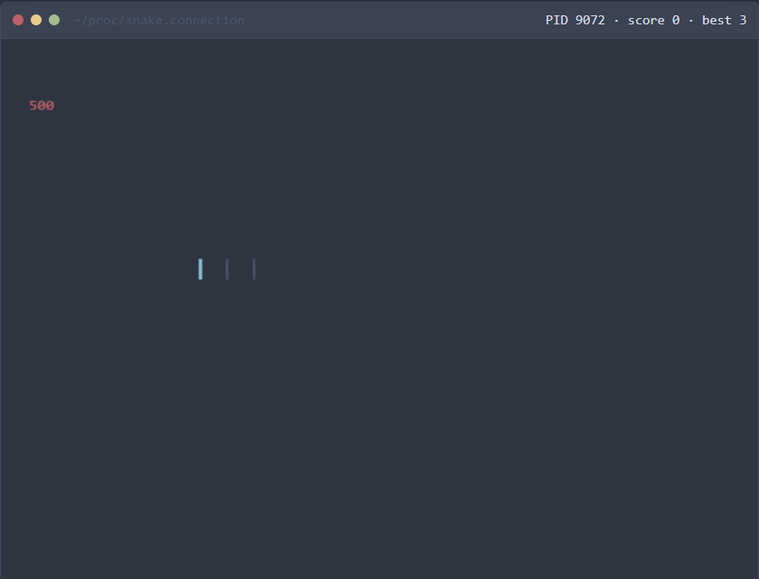

# Snake Game — `~/proc/snake.connection`

A terminal-themed Snake game built with React + Vite. You play a blinking cursor crawling through a fake macOS terminal window, eating HTTP status codes instead of apples, while the process "crashes" with a segfault when you die.



## Features

- 🖥️ Retro terminal window chrome (traffic-light dots, fake path bar, live PID/score/best HUD)
- 🐍 Classic grid-based Snake gameplay rendered on `<canvas>`
- 🔢 Food rendered as color-coded HTTP status codes (`200`, `404`, `500`, etc.)
- ⚡ Speed ramps up as your score increases
- 🏆 High score persisted to `localStorage`
- ⌨️ Arrow keys or WASD controls, pause/resume support

## Controls

| Key | Action |
| --- | --- |
| `Arrow Keys` / `W` `A` `S` `D` | Move |
| `Space` | Start / restart |
| `Esc` / `P` | Pause / resume |

## Getting Started

```bash
npm install
npm run dev
```

Then open the local URL Vite prints (default `http://localhost:5173`).

### Other scripts

```bash
npm run build    # production build
npm run preview  # preview the production build locally
npm run lint     # run ESLint
```

## Project Structure

```
src/
  game/
    constants.js   # board size, colors, status code tokens, speed curve
    engine.js      # pure game logic (movement, collisions, scoring)
  components/
    SnakeGame.jsx   # rendering, input handling, game loop
    SnakeGame.css
  App.jsx
  main.jsx
```

## Tech Stack

- [React](https://react.dev/) 19
- [Vite](https://vite.dev/) for dev server & bundling
- HTML5 `<canvas>` for rendering
